 # praktikum 3
 ## Latihan 1
 ### Penggunaan End
 #### - end berfungsi untuk mengganti karakter terakhir bawaan yang dicetak di layar. Jadi secara bawaan, setiap kali kita memanggil fungsi print() untuk mencetak sesuatu, python akan mencetak karakter ganti baris ( ) di setiap output.
 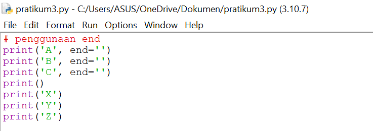
 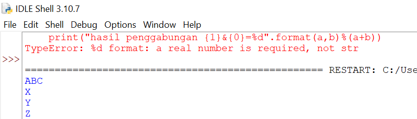
 ## Penggunaan Separator
 #### - Penggunaan separator pada python berfungsi sebagai pemisah setiap variabel yang telah diberi nilai
 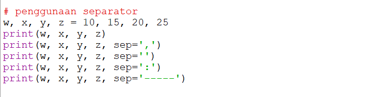
 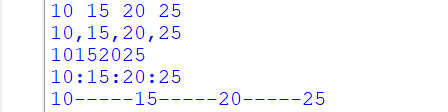
 ## String Format
 #### - String Formatting atau performatan string memungkinkan kita menyuntikan item ke dalam string dari pada kita mencobamenggabungkan string menggunakan koma atau string concatenation.
 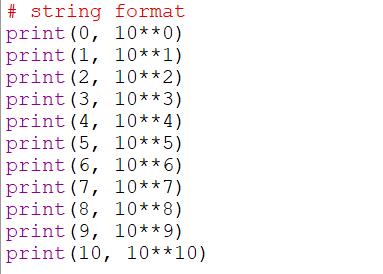
 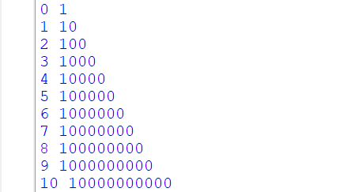
 #### - Ini adalah contoh string formatting 
 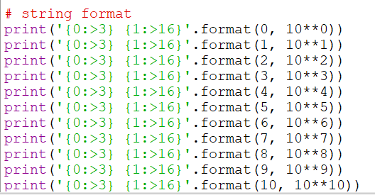
 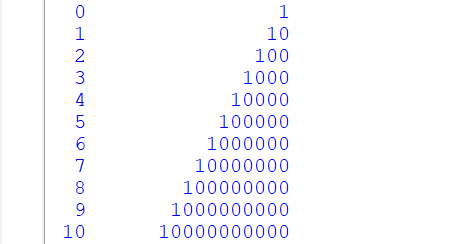
 #### - Ada tiga cara untuk melakukan performatan string
 ##### - Metode lama menggunakan placeholder menggunakan karakter '%'(modulo)'
 ##### - Teknik yang diinginkan menggunakan metode string .format()
 ##### - Metode terbaru, diperkenalkan dengan python 3.6, menggunakan string literal yang diformat *f-string*
 ## Latihan 2
 #### - Tentukan variabel terlebih dahulu, saya memakai dua variabel, yaitu a dan b
 #### - Beri inputan pada variabel
 #### - Setelah diberi input, ekspresikan variabel yang telah diberi inputan
 #### - Lalu lita coba menggabungkan variabel a dan b dengan *Formatting String*
 ![Gambar1][(gambar/gmbr9.png)
 ### Konversi nilai variabel
 #### - Konversi nilai variabel yang masih berbentuk 'string' pada 'intregen'
 #### - Setelah itu menjumlahkan dan membagi dengan mengekspresikan dalam bentuk *Formatting String*
 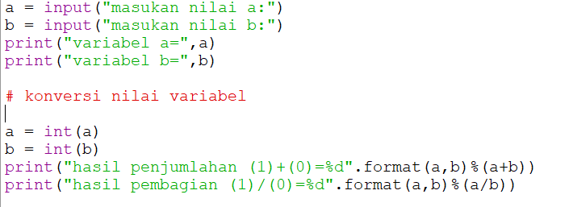
 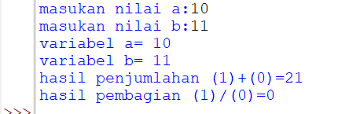
 ## Latihan 3
 ### Buatlah kode program menggunakan string formattinguntuk menghasilkan output seperti gambar dibawah ini
 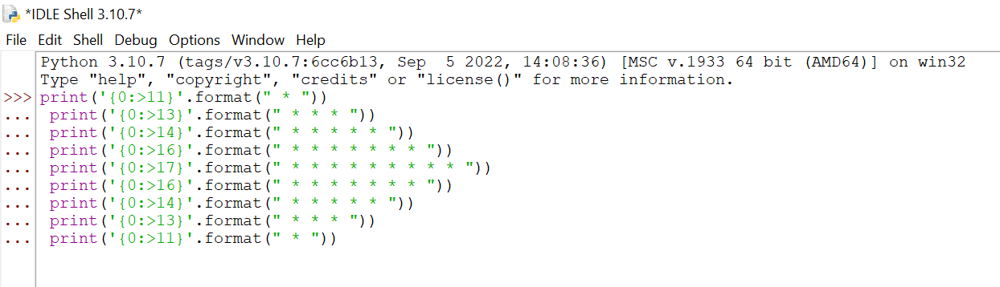
 ```
 print('{0:>11}'.format(" * "))
 print('{0:>13}'.format(" * * * "))
 print('{0:>14}'.format(" * * * * * "))
 print('{0:>16}'.format(" * * * * * * * "))
 print('{0:>17}'.format(" * * * * * * * * * "))
 print('{0:>16}'.format(" * * * * * * * "))
 print('{0:>14}'.format(" * * * * * "))
 print('{0:>13}'.format(" * * * "))
 print('{0:>11}'.format(" * "))
 ```
 ### - Agar menampilkan output yang sama dengan latihan 3.1 yaitu dengan menjalankan hasil dari statement yang telah di buat dan setelah itu kita di suruh menginput *numeric* 5
 
 
 ## Pratikum 3
 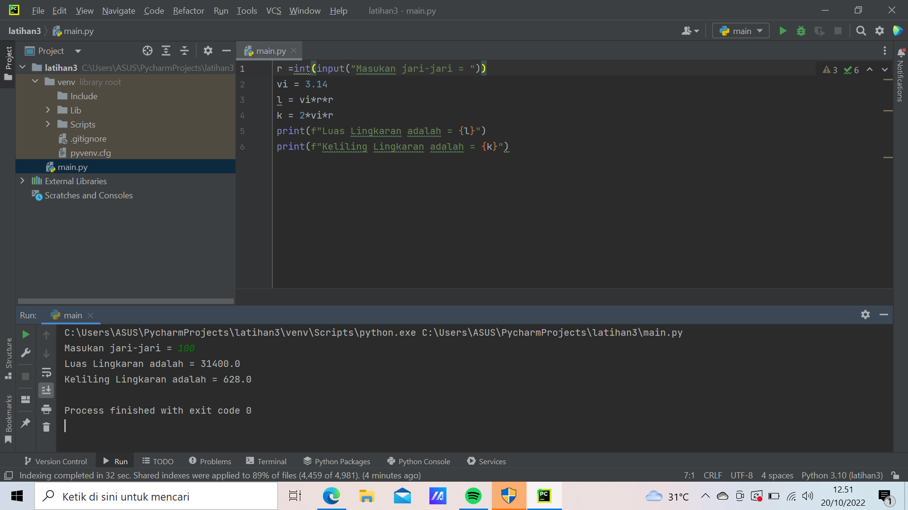
 ### Hasil pratikum 3 yang telah saya lakukan yaitu:
 #### - Dapat memahami algoritma lingkaran yang diproses dala python 
 #### - Dapat menjelaskan bagaimana langkah-langklah membuat algoritma lingkaran pada python
 #### - Dapat membuat *Flowchart* algoritma dengan baik dan benar
 #### - Dapat mengoprasikan langsung algoritma lingkaran pada python
 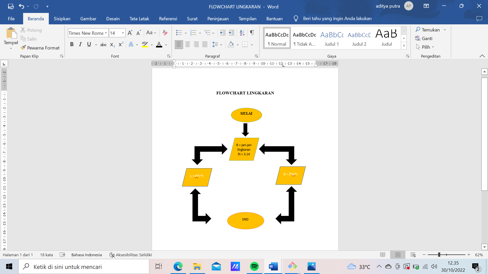
